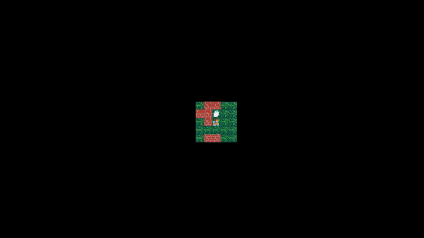

# Sorting the stack

In this project, a simple 2D game was implemented about a developer who is in a hurry to get down to work, but first he needs to solve a more important problem!
The entire visual part is fully supported by the minilibx library for C
The game can accept any valid card created by the user, and it looks like this:

   ```sh
   1111111111111111111111111111111111
   1E0000000000000C00000C000000000001
   1010010100100000101001000000010101
   1010010010101010001001000000010101
   1P0000000C00C0000000000000000000C1
   1111111111111111111111111111111111
   ```

    "1" is a wall
    "0" is the play space
    "P" is the player
    "C" is a coin

## Technologies

1. C
2. Make

## Launch

1. Build a project using Makefile

   ```sh
   $ make
   ```

2. Run the program with one argument (map), like this:

   ```sh
   $ ./so_long coderka_game.ber
   ```
   
3. Control

  - W = UP
  - S = DOWN
  - A = LEFT
  - D = RIGHT


## Game process

  
